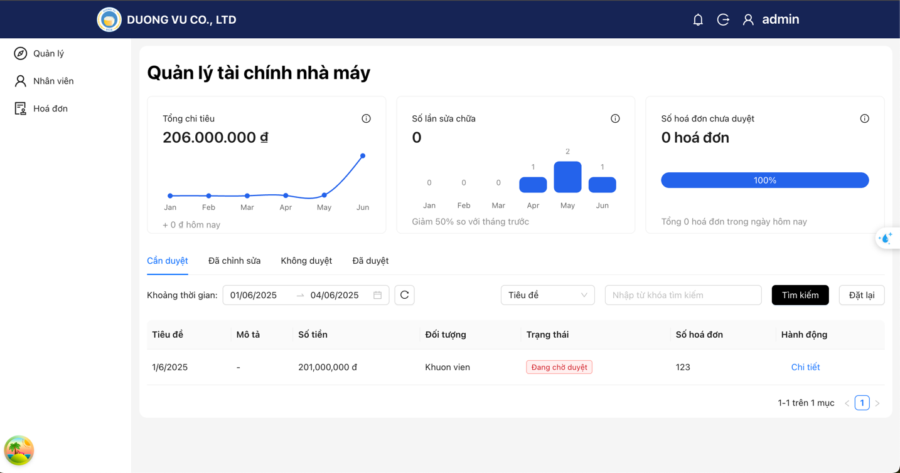

# ERP System



This repository contains both the backend (BE) and frontend (FE) for the ERP system.

---

## Backend (DuongVu-BE)

**Tech Stack:** Java 17+, Spring Boot, Maven

### Getting Started
1. Install Java 17+ and Maven.
2. Navigate to `DuongVu-BE` directory.
3. Build and run:
   ```bash
   ./mvnw clean install
   ./mvnw spring-boot:run
   ```
4. The backend will start on port 8080 by default (configurable in `src/main/resources/application.properties`).

### Docker
To build and run with Docker:
```bash
docker build -t duongvu-be .
docker run -p 8080:8080 duongvu-be
```

### Project Structure
- `src/main/java` - Java source code
- `src/main/resources` - Configuration files
- `src/test/java` - Test code

---

## Frontend (DuongVu-FE)

**Tech Stack:** React, Vite, TypeScript

### Getting Started
1. Install Node.js 18+ and npm (or yarn).
2. Navigate to `DuongVu-FE` directory.
3. Install dependencies:
   ```bash
   npm install
   ```
4. Start the development server:
   ```bash
   npm run dev
   ```
5. The app will be available at [http://localhost:5173](http://localhost:5173) by default.

### Linting
```bash
npm run lint
```

### Building for Production
```bash
npm run build
```

### Docker
To build and run with Docker:
```bash
docker build -t duongvu-fe .
docker run -p 5173:80 duongvu-fe
```

### Project Structure
- `src/` - Source code
- `public/` - Static assets
- `doc/` - Documentation and hooks usage

---

## License

This project is licensed under the MIT License.

